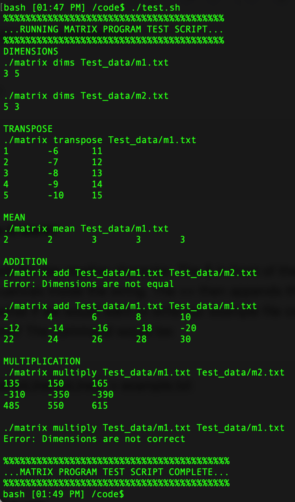

# Matrix Arithmetic shell script

###### Calculate the dimensions and mean of a matrix, perform transposition, addition, and multiplication operations.

## Requirements
- POSIX compliant operating system with Bash shell.
- Matrices are tab-delimited signed ints in text files containing only one matrix. Matrices must be rectangular with each line ending in a '\n'.

## Usage
 Command line operation in bash shell with input from text files. Each command verifies the number of arguments and that file(s) were successfully opened. File are not modified.

Eg: `./matrix <command> file1 [file2]`

#### Dimensions
Print the dimensions of a matrix as "row column"

Eg: `./matrix dims m1.txt`

#### Transpose
Print the transposed matrix

Eg: `./matrix transpose m1.txt`

#### Mean
Print the mean of each column

Eg: `./matrix mean m1.txt`

#### Add
Print the sum of two matrices. Checks that the dimensions are the same first

Eg: `./matrix add m1.txt m2.txt`

#### Multiply
Print the product of two matrices. Checks that the dimensions are correct (the number of columns in the first matrix equals the number of rows in the second matrix)

Eg: `./matrix multiply m1.txt m2.txt`

## Output

#### Test Scripts
Run test.sh for a quick test
1. `./test.sh`

Run p1gradingscript for a full test
2. `./p1gradingscript`
